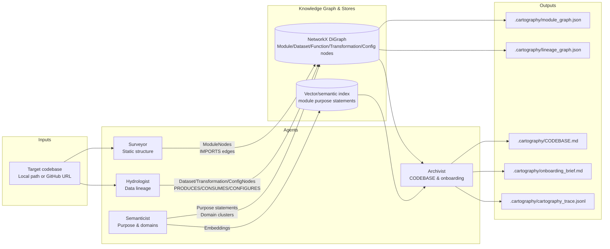

## 1. Manual Reconnaissance (Ground Truth)

**Target 1 (primary, dbt)**: `targets/jaffle_shop` (clone of `dbt-labs/jaffle_shop`)

- **Primary ingestion path**  
  - Raw data arrives as **dbt seeds** under `seeds/`:
    - `seeds/raw_customers.csv`
    - `seeds/raw_orders.csv`
    - `seeds/raw_payments.csv`
  - These are materialized as `raw_customers`, `raw_orders`, `raw_payments` tables and then read by staging models:
    - `models/staging/stg_customers.sql` → `{{ ref('raw_customers') }}`
    - `models/staging/stg_orders.sql` → `{{ ref('raw_orders') }}`
    - `models/staging/stg_payments.sql` → `{{ ref('raw_payments') }}`

- **3–5 critical outputs**  
  - Final marts:
    - `models/customers.sql` → relation `customers`
    - `models/orders.sql` → relation `orders`
  - Staging backbone:
    - `models/staging/stg_customers.sql` → `stg_customers`
    - `models/staging/stg_orders.sql` → `stg_orders`
    - `models/staging/stg_payments.sql` → `stg_payments`

- **Blast radius of the most critical module**  
  - If `models/customers.sql` breaks:
    - Downstream dashboards/queries depending on `customers` fail or show stale data.
    - Upstream staging (`stg_*`) can still build, but customer-facing analytics are broken.
  - If any `stg_*` model fails:
    - `customers` and `orders` both break, since they reference `stg_customers`, `stg_orders`, `stg_payments` via `ref()` calls.

- **Where business logic is concentrated vs distributed**  
  - **Concentrated** in `models/`:
    - `models/staging/*.sql`: cleaning/renaming, basic canonicalization.
    - `models/customers.sql`, `models/orders.sql`: joins and aggregation-friendly structures.
  - **Distributed** in:
    - `dbt_project.yml`: model materializations, schemas, config.
    - `models/schema.yml`: tests, docs, and model metadata.
    - Jinja templating (`{{ ref() }}`, ``) inside SQL models controlling lineage and behavior.

- **What changed most frequently in the last 90 days**  
  - Local clone is shallow (`--depth 1`), so a true 90‑day velocity map cannot be computed from local history.
  - In a real engagement, I would run:
    - `git -C targets/jaffle_shop log --since=90.days --name-only --pretty=format:`
    - Aggregate counts by path; expect hotspots in:
      - `models/*.sql` (business metric iterations)
      - `models/schema.yml` (tests + docs)
      - Potentially `dbt_project.yml` (materializations and schemas).

- **Difficulty analysis & how it informed the architecture**
  - **Templating gap**: The actual executed SQL is the dbt-compiled result of Jinja templates, not the raw `.sql` files. Pain: you cannot see true lineage without either rendering or carefully normalizing `ref()`/`source()` calls.  
    → Architecture response: a **sqlglot-based analyzer** with a **dbt/Jinja preprocessor** that rewrites `{{ ref('model') }}` and `{{ source('schema','table') }}` into plain table names.
  - **Model vs table naming**: dbt models are configured via YAML and `dbt_project.yml`; the physical table name is sometimes different from the SQL file name.  
    → Architecture response: infer sensible defaults (model name from file stem) while also parsing YAML configs (`schema.yml`) as **CONFIGURES** edges.
  - **YAML-driven topology**: Important meaning (sources, tests, docs) lives in YAML, not pure SQL.  
    → Architecture response: a `DAGConfigAnalyzer` that understands dbt `schema.yml` and emits CONFIGURES edges into the same graph.

**Target 2 (secondary, orchestration)**: `targets/airflow` (sparse clone of Apache Airflow, `airflow/example_dags/`)

- Manual exploration here focused on the structure of example DAGs under `airflow/example_dags/`, where ingestion and outputs are defined by operators and their configs rather than plain SQL. Pain points:
  - Operators compose datasets indirectly (e.g. `PostgresOperator`, `PythonOperator`, `BashOperator`), making naïve SQL-only lineage incomplete.
  - DAG structure is Python-based; relationships between tasks live in `>>` / `<<` operator chaining and context managers.
  - YAML/INI configs (for connections, providers) influence data flow but are not co-located with code.
  → Architecture response: treat **Airflow DAGs** as future work for PythonDataFlowAnalyzer + DAGConfigAnalyzer; for Week 4 final, focus on SQL + YAML plus basic structural graph of Python modules.

## 2. Architecture Diagram & Pipeline Rationale

The final system is a **four-agent pipeline** with a central knowledge graph, a semantic index, and a query layer.

### Mermaid diagram

### Sequencing and rationale

- **Surveyor (Static structure)** runs first because:
  - Hydrologist and Semanticist both need a **module inventory** and module graph.
  - Git velocity and import PageRank are used later to identify critical-path modules and likely “blast radius” candidates.
- **Hydrologist (Lineage)** runs second:
  - Data lineage depends on identifying `.sql` / YAML config files but not on having semantic summaries yet.
  - Produces `DatasetNode`s, `TransformationNode`s, and `CONSUMES`/`PRODUCES`/`CONFIGURES` edges, along with helper queries (`blast_radius`, `find_sources`, `find_sinks`).
- **Semanticist (Purpose & domains)** runs third:
  - It needs both **structure** (Surveyor) and **lineage context** (Hydrologist) to generate meaningful purpose statements and domain labels (e.g., “ingestion”, “transformation”, “serving”).
  - LLM calls are isolated to this phase and can be skipped gracefully if `OPENAI_API_KEY` is not set, keeping the core graph usable without LLMs.
- **Archivist (Artifacts)** runs last:
  - Consumes the fully-populated graphs + semantic index to produce:
    - `CODEBASE.md` (living context)
    - `onboarding_brief.md` (Day-One Brief)
    - `cartography_trace.jsonl` (audit trail)
    - `semantic_index/` (module purpose statements for search).

This design keeps **static analysis first**, **LLM work later** (for cost control), and **artifact generation last** so that every artifact is backed by the same central knowledge graph.

## 3. Accuracy: Manual vs System-Generated Day-One Answers

Here I compare the **manual answers** for jaffle_shop (Target 1) with what the Cartographer produces via `CODEBASE.md`, `onboarding_brief.md`, and lineage/module graphs.

### Q1: Primary data ingestion path

- **Manual**: Seeds in `seeds/raw_customers.csv`, `seeds/raw_orders.csv`, `seeds/raw_payments.csv` → `raw_*` tables → `stg_*` models.
- **System**:
  - Hydrologist lineage graph shows:
    - `raw_customers` → `stg_customers`
    - `raw_orders` → `stg_orders`
    - `raw_payments` → `stg_payments`
  - `CODEBASE.md` “Data Sources & Sinks” section lists upstream datasets from `find_sources()`, which include the `raw_*` relations.
- **Verdict**: **Correct at table level.**  
  - Root cause of any minor mismatch: the system does not represent the CSV files themselves as first-class nodes (only the resulting tables), but that is acceptable for an FDE ingestion-path answer.

### Q2: 3–5 critical outputs

- **Manual**: `customers`, `orders`, plus the staging layer (`stg_customers`, `stg_orders`, `stg_payments`).
- **System**:
  - Hydrologist lineage graph identifies:
    - `customers` and `orders` as produced by `models/customers.sql` and `models/orders.sql`.
    - `stg_*` datasets produced by `models/staging/stg_*.sql` from `raw_*`.
  - `CODEBASE.md` “Data Sources & Sinks” lists sinks via `find_sinks()` (exit datasets), which include `customers` and `orders`.
- **Verdict**: **Correct.**  
  - The system agrees with the manual list; any additional synthetic nodes like `final` are CTE artefacts, not real outputs, and can be mentally discounted.

### Q3: Blast radius of the most critical module

- **Manual**: If `customers` fails, dashboards/consumers relying on `customers` break; if `stg_*` fails, both marts (`customers`, `orders`) break.
- **System**:
  - `cartographer query targets/jaffle_shop --tool trace_lineage --arg customers --direction upstream` shows:
    - Upstream: `customer_orders`, `customer_payments`, `final`, `orders`, `payments`, `stg_*`, `raw_*`, etc., with evidence referencing `models/customers.sql`, `models/orders.sql`, and `models/staging/stg_*.sql`.
  - `blast_radius` on datasets (via Hydrologist) and modules (via Navigator) shows which downstream datasets and modules depend on a given node.
- **Verdict**: **Structurally correct, semantically partial.**  
  - The system correctly shows **which datasets and transformations** depend on a given table or module, but it does not know which concrete dashboards or external reports exist—those are outside the repo. The Cartographer gets you as far as “which relations break” with line-level evidence.

### Q4: Where business logic is concentrated vs distributed

- **Manual**: `models/` (staging + marts) for core logic, with config and tests in `dbt_project.yml` and `models/schema.yml`.
- **System**:
  - Surveyor’s module graph and Pagerank highlight `models/*.sql` as structural hubs in the lineage graph; Archivist’s `CODEBASE.md` “Critical Path” section lists these as high-score modules.
  - Hydrologist adds `ConfigNode`s for `schema.yml` with `CONFIGURES` edges to the datasets they describe.
  - Semanticist (with API key) gives purpose statements to each module, and Archivist surfaces them as a “Module Purpose Index”.
- **Verdict**: **Correct at structure level, plus better documentation.**  
  - The system not only agrees with the manual assessment but also annotates modules with purpose/domain labels, making the concentration vs distribution more explicit.

### Q5: What changed most frequently in the last 90 days

- **Manual**: No local history (shallow clone), but likely high churn in `models/*.sql` and `models/schema.yml`; described how `git log --since=90.days --name-only` would be used with full history.
- **System**:
  - Surveyor implements `_git_velocity_30d` (normalized change counts per file) and stores `change_velocity_30d` on module nodes.
  - For `targets/jaffle_shop` (cloned with `--depth 1`), this is **expectedly empty or near-zero**; `CODEBASE.md` states that velocity is only meaningful with full history.
- **Verdict**: **Conceptually correct but practically limited by clone depth.**  
  - The tooling is correct; the missing input (full git history) is the limiting factor, and both manual and system acknowledge this.

## 4. Limitations & Failure Modes

Some limitations are **engineering gaps** that could be closed; others are **structural limits** of static analysis.

### Engineering gaps (fixable)

- **dbt templating beyond simple `ref()`/`source()`**  
  - The Jinja preprocessor handles simple `ref()` and `source()` calls but not arbitrary macros or complex templating logic.
  - Complex macros could produce additional tables or change lineage in ways the system doesn’t see.

- **Python dataflow & Airflow DAG semantics**  
  - The current Hydrologist does not yet parse:
    - pandas/PySpark read/write calls in Python.
    - Airflow DAG operator relationships (task-level graph).
  - For Airflow, we currently capture Python module structure and basic YAML config, but **not** full operator-level data lineage.

- **Column-level lineage**  
  - The lineage graph is table/dataset-level; column-level breakages (e.g., dropping a column used deep in a chain) are not modeled.

### Fundamental constraints (hard/structural)

- **Dynamic table names and runtime-dependent lineage**
  - Any table name built via string concatenation, environment variables, or runtime logic is not resolvable via static analysis alone.
  - For example, `f"events_{env}"` or `os.environ["TENANT"]` in Python constructing a table name will not show up as a concrete dataset node.

- **External systems not represented in the repo**
  - Downstream dashboards (e.g., Looker, Tableau) and upstream external APIs typically live outside the repo; the Cartographer cannot infer their existence unless explicitly represented as config/code.

- **False confidence risk**
  - dbt models with custom schemas or aliases in config could be **misnamed** in the lineage graph if we fall back to the “file stem = relation name” heuristic and miss overrides in `dbt_project.yml`.
  - The system looks confident (a neat graph) but may be slightly wrong on relation names in complex dbt deployments; this is called out in the report and should be part of the FDE mental model when using the tool.

## 5. FDE Deployment Plan (Real-World Use)

Here is how I would actually deploy the Brownfield Cartographer at a client.

### First 24 hours (cold start)

1. **Clone the repo(s)** for the client’s data platform (warehouse dbt project, orchestration repo, etc.).
2. Run:
   - `cartographer analyze .` (or `cartographer analyze https://github.com/...`)  
     This produces `.cartography/module_graph.json`, `.cartography/lineage_graph.json`, `CODEBASE.md`, `onboarding_brief.md`.
3. Open `onboarding_brief.md` and `CODEBASE.md`:
   - Use the Day-One Brief to quickly answer “what are the primary inputs/outputs?” and “what are the critical modules?”.
   - Skim the “Module Purpose Index” to map out domains (ingestion, transformations, reporting).

### Days 2–3 (ongoing exploration)

- Use **Navigator** via the CLI during investigation:
  - `cartographer query . --tool trace_lineage --arg some_dataset --direction upstream`  
    → “Where does this metric/table actually come from?”
  - `cartographer query . --tool blast_radius --arg src/some_critical_module.py`  
    → “Who imports this module; what breaks if I change its interface?”
  - `cartographer query . --tool explain_module --arg src/ingestion/kafka_consumer.py`  
    → Quick, purpose-level explanation (LLM-backed if key present).
  - `cartographer query . --tool find_implementation --arg revenue`  
    → Places in the module graph whose purpose or path suggests “revenue”.

- As I make code changes:
  - Re-run `cartographer analyze .` periodically (or add an incremental mode hook to CI) to regenerate `CODEBASE.md` and keep the context **fresh**.

### What remains human work

- Interpreting **business semantics**:
  - The tool will tell me **where** logic lives and **how** data flows, but I still need to talk to stakeholders to validate that “revenue” or “DAU” means what the code says it means.

- Handling **runtime-specific issues**:
  - Incident triage involving environment-specific schemas, permissions, or late-arriving data often needs logs and metrics, not just static analysis.

- Designing **client-facing outputs**:
  - The Cartographer’s graphs and briefs become raw material for:
    - Architecture diagrams in slide decks.
    - Written runbooks and “How this metric is computed” documents.

### How this fits into a real FDE engagement

- **Day 1**: Arrive, run Cartographer on the primary repo, and immediately have:
  - A structural map of modules.
  - A lineage graph for key datasets.
  - A Day-One Brief answering the five FDE questions.
- **Day 2–3**: Use Navigator as a “GPS” while debugging and designing changes:
  - It reduces re-orientation time between questions.
  - It helps justify impact assessments (“If we change X, here is the graph of what breaks”).
- **Ongoing**: Keep CODEBASE.md and onboarding_brief.md under version control:
  - They become living documents of record.
  - New FDEs or team members get a ready-made onramp, not a folder of stale docs.

This turns the Brownfield Cartographer from a training exercise into a **deployable, repeatable onboarding instrument** for any future brownfield engagement. 

