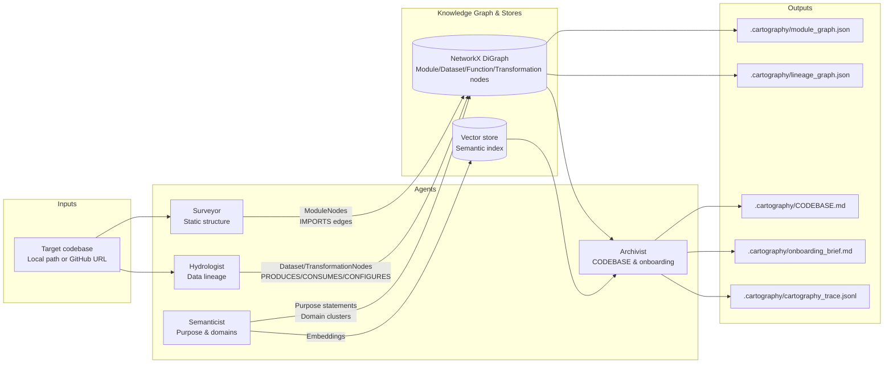

## Reconnaissance (manual)

See `RECONNAISSANCE.md` (target: `targets/jaffle_shop`).

## System architecture (interim, four-agent view)

Conceptual four-agent pipeline (current interim run implements the first two, but the final architecture is already laid out this way):

- **System input**: target repo path or GitHub URL (interim CLI accepts both and clones GitHub URLs into `targets/<owner>__<repo>`).
- **Surveyor (Static Structure Analyst)**:
  - Reads files via tree-sitter (Python) and basic filesystem inspection.
  - Produces `ModuleNode`s and `IMPORTS` edges, plus structural metrics (PageRank, SCCs, change velocity when git history exists).
- **Hydrologist (Data Flow & Lineage Analyst)**:
  - Uses `SQLLineageAnalyzer` (sqlglot + dbt/Jinja preprocessor) to extract table-level dependencies.
  - Produces `DatasetNode`s, `TransformationNode`s, and `CONSUMES` / `PRODUCES` / `CONFIGURES` edges.
- **Semanticist (LLM-Powered Purpose Analyst)**:
  - Planned: consumes graph + code to attach `purpose_statement`, `domain_cluster`, and documentation drift flags to nodes.
- **Archivist (Living Context Maintainer)**:
  - Planned: reads from the knowledge graph and writes `CODEBASE.md`, `onboarding_brief.md`, `cartography_trace.jsonl`, and semantic index.
- **Central knowledge graph**:
  - Implemented as a NetworkX `DiGraph` wrapped by `src/graph/knowledge_graph.py` with JSON node-link serialization.
  - Shared store that Surveyor/Hydrologist (and later Semanticist/Archivist) read/write.
- **System outputs (interim)**:
  - Per-target repo `.cartography/module_graph.json`, `.cartography/lineage_graph.json`, `.cartography/run_summary.json`.

Mermaid-style architecture diagram (copy into a Mermaid renderer and tweak as needed):

Artifacts written per analyzed repo:

- `.cartography/module_graph.json`
- `.cartography/lineage_graph.json`
- `.cartography/run_summary.json`

## Progress summary: component status

- **CLI & Orchestrator**
  - Status: **Working**
  - Details: `src/cli.py` accepts a local repo path (`cartographer <repo>` or `cartographer analyze <repo>`). `src/orchestrator.py` sequences Surveyor → Hydrologist and writes `.cartography/*.json`.

- **Knowledge graph data model & storage**
  - Status: **Working (nodes + edge types, storage), edges not yet Pydantic-typed**
  - Details:
    - `src/models/nodes.py` defines `ModuleNode`, `DatasetNode`, `FunctionNode`, `TransformationNode` with fields for `purpose_statement`, `domain_cluster`, `change_velocity_30d`, `is_dead_code_candidate`, etc. (not all populated yet).
    - `src/graph/knowledge_graph.py` wraps NetworkX `DiGraph` with `add_node`, `add_edge` (typed `edge_type`), PageRank, SCCs, and node-link JSON (de)serialization. Edge types used so far: `IMPORTS`, `CONSUMES`, `PRODUCES`.

- **Tree-sitter analyzer (multi-language AST parsing infrastructure)**
  - Status: **Working for Python; SQL/YAML handled via dedicated analyzers instead of tree-sitter**
  - Details:
    - `src/analyzers/tree_sitter_analyzer.py` uses `tree-sitter-languages` to parse Python, extracting imports (`import`/`from` statements) and public function/class definitions (signatures + line ranges).
    - A `LanguageRouter`-style interface is in place (parsers managed per language string); today, Surveyor uses it for Python; SQL is parsed via `sqlglot`, YAML via `pyyaml`.
    - Unparseable Python files are logged as warnings and skipped (no crash).

- **SQL dependency extraction**
  - Status: **Working (dbt-friendly table-level lineage via sqlglot)**
  - Details:
    - `src/analyzers/sql_lineage.py` uses `sqlglot` to parse SQL and extract tables referenced in `FROM`/`JOIN`/CTEs, plus write targets from `CREATE`, `INSERT`, `MERGE`.
    - A dbt/Jinja preprocessor:
      - Strips `` blocks.
      - Rewrites `{{ ref('model') }}` to `model`.
      - Rewrites `{{ source('schema','table') }}` to `schema.table`.
    - Output is `SqlStatementLineage` objects with per-statement sources/targets and a stable transformation id (used by Hydrologist).
    - Unparseable SQL files are logged as `sql_parse_failed:<file>:<error>` and skipped.

- **Surveyor agent — module graph and structural analysis**
  - Status: **Working (imports, PageRank, SCCs); git velocity partially working**
  - Details:
    - `src/agents/surveyor.py`:
      - Walks the repo with `iter_files`.
      - Uses the tree-sitter analyzer to parse Python, extract imports, and resolve them to relative module paths via `_build_python_module_index` + `_resolve_python_import` (handles relative imports like `from .foo import bar`).
      - Builds a NetworkX DiGraph of `IMPORTS` edges (`module:<path>` → `module:<path>`).
      - Computes PageRank via a custom power-iteration implementation (avoids SciPy dependency) and writes scores to node attributes.
      - Computes strongly connected components and stores non-trivial SCCs on the graph metadata.
      - Git velocity: `_git_velocity_30d` inspects `git log --since=<date> --name-only` when `.git/` is present, normalizing counts per file into `[0,1]` as `change_velocity_30d` on nodes. For `targets/jaffle_shop` (cloned with `--depth 1`), this is essentially empty, which is expected and documented.

- **Hydrologist agent — data lineage graph**
  - Status: **Working (SQL/dbt lineage), Python/YAML lineage not yet integrated**
  - Details:
    - `src/agents/hydrologist.py`:
      - Scans for `.sql` files.
      - Uses `SQLLineageAnalyzer` to produce `SqlStatementLineage` per file.
      - Creates `TransformationNode`s keyed by `source_file` and statement index, plus `DatasetNode`s for each table name.
      - Adds `CONSUMES` edges (transformation → dataset) and `PRODUCES` edges (transformation → dataset).
      - For dbt models (paths under `models/`), if there is no explicit SQL target, it infers a target dataset from the file stem (e.g., `models/customers.sql` → dataset `customers`).
    - Implements `blast_radius(dataset_name)` as a BFS over the lineage graph (dataset ←CONSUMES–transformation–PRODUCES→dataset) to find all downstream datasets.
    - `find_sources` / `find_sinks` are planned for final but not yet implemented (entry/exit point detection).

- **React graph viewer (web)**
  - Status: **Working**
  - Details:
    - `web/` contains a Vite + React app that accepts uploaded `.cartography/module_graph.json` or `.cartography/lineage_graph.json` (NetworkX node-link JSON) and renders an interactive graph (Cytoscape + fcose layout) with node metadata inspection.

## Proof of execution (artifacts)

Target: `targets/jaffle_shop`

- `targets/jaffle_shop/.cartography/module_graph.json`
- `targets/jaffle_shop/.cartography/lineage_graph.json`

From `targets/jaffle_shop/.cartography/run_summary.json`:

- modules: 8
- datasets: 15
- lineage edges: 27

## Early accuracy observations

- **Lineage — specific correct detections (targets/jaffle_shop)**:
  - `models/customers.sql` is represented as a `TransformationNode` (`source_file: "models/customers.sql"`). The lineage graph shows it **consuming**:
    - `dataset:stg_customers`, `dataset:stg_orders`, `dataset:stg_payments`, `dataset:customer_orders`, `dataset:customer_payments`, and a synthetic `dataset:final`, and **producing** `dataset:customers`.
    - This matches the actual SQL, which selects from the staging models and intermediate CTEs to build `customers`.
  - `models/orders.sql` appears as another `TransformationNode` that **consumes** `stg_orders`, `stg_payments`, `order_payments`, `final` and **produces** `orders`.
  - `models/staging/stg_customers.sql`, `stg_orders.sql`, and `stg_payments.sql` correctly show:
    - `raw_customers` → `stg_customers`
    - `raw_orders` → `stg_orders`
    - `raw_payments` → `stg_payments`
- **Lineage — inaccuracies / artefacts and likely causes**:
  - The graph includes synthetic datasets like `source`, `renamed`, and `final` that correspond to intermediate CTE names inside dbt models (e.g., `source` / `renamed` CTEs in `stg_*` models, `final` in `orders.sql` and `customers.sql`). These are useful to understand the flow but are *not* materialized tables; risk: they may look like real warehouse tables.
  - Some dbt semantics are still approximate: we infer targets from file stems (`models/customers.sql` → `customers`) rather than reading dbt config or compiled SQL. Models with custom schemas or aliases could therefore be mis-labeled in the lineage graph.
  - Complex Jinja/macros beyond simple `ref()`/`source()` would either be stripped or misinterpreted by the sanitizer; those patterns are not present in `jaffle_shop`, but they are a known limitation for larger real-world dbt repos.

## Completion plan for final submission

**Critical path (must-have for final):**

1. **Knowledge graph enrichment & edge typing**
   - Attach Pydantic-backed metadata more systematically when writing to the `KnowledgeGraph` (e.g., ensure `ModuleNode`/`DatasetNode` fields like `change_velocity_30d`, `purpose_statement`, `domain_cluster`, `is_dead_code_candidate` are filled where possible).
   - Introduce a light-weight edge schema (or enumerated edge types) to cover all 5 edge kinds: `IMPORTS`, `PRODUCES`, `CONSUMES`, `CALLS`, `CONFIGURES`.

2. **Semanticist agent**
   - Implement a `src/agents/semanticist.py` that:
     - Generates purpose statements for modules/functions using a cost-aware LLM budget (fast model for bulk, higher-end model for synthesis).
     - Detects documentation drift by comparing docstrings (if any) to implementation-based summaries.
     - Embeds purpose statements and clusters modules into inferred domains (`ingestion`, `staging`, `marts`, etc.).
   - Risk: prompt design and context window management will require iteration; mitigation is to start with small per-module prompts and only later add whole-graph synthesis.

3. **Archivist agent + CODEBASE/onboarding outputs**
   - Implement `src/agents/archivist.py` that:
     - Reads the knowledge graph and writes `CODEBASE.md`, `onboarding_brief.md`, `cartography_trace.jsonl`.
     - Structures `CODEBASE.md` explicitly for agent injection (Architecture Overview, Critical Path, Data Sources/Sinks, Known Debt, High-Velocity Files).
   - Dependency: meaningful outputs from Surveyor/Hydrologist + at least basic Semanticist metadata.

4. **Navigator / query interface**
   - Implement `src/agents/navigator.py` (and CLI `cartographer query ...`) that:
     - Provides tools `find_implementation(concept)`, `trace_lineage(dataset, direction)`, `blast_radius(module_path)`, `explain_module(path)`.
     - Uses graph queries for structural/lineage questions and LLM only for explanation and semantic search.
   - Risk: tuning query UX; mitigation is to focus first on `trace_lineage` and `blast_radius`, which are directly graph-based.

5. **Incremental update mode**
   - Teach the orchestrator to:
     - Detect new commits via `git log` or a stored `last_analyzed_commit`.
     - Re-run analyzers only for changed files and patch the existing `.cartography/*.json` graphs.
   - This is critical for real deployments but can be implemented after the agents are functional.

**Stretch / nice-to-have if time permits:**

- **Python/YAML lineage**: plug in a `PythonDataFlowAnalyzer` and `DAGConfigAnalyzer` to add:
  - pandas / PySpark read/write detection.
  - Airflow/dbt YAML topology to the lineage graph.
- **Column-level hints**: limited column-level lineage for a subset of SQL patterns, clearly marked as “best-effort”.

If time becomes tight, the fallback is to:

- Prioritize fully working Semanticist + Archivist on top of the existing Surveyor/Hydrologist outputs (so Day-One questions and CODEBASE/onboarding artifacts are accurate), and
- Defer advanced Python/YAML lineage and column-level analysis as clearly documented future work.

## Known gaps (planned for final)

- **Git velocity map**: compute 30/90‑day change frequency (requires full git history and robust path mapping).
- **Python runtime & DAG lineage**: pandas/PySpark I/O, Airflow DAG extraction, and deeper dbt YAML (`schema.yml`) semantics are not yet merged into the unified lineage graph.
- **Semanticist + Archivist + Navigator**: purpose statements, doc drift flags, CODEBASE.md + onboarding brief generation, interactive query mode.

